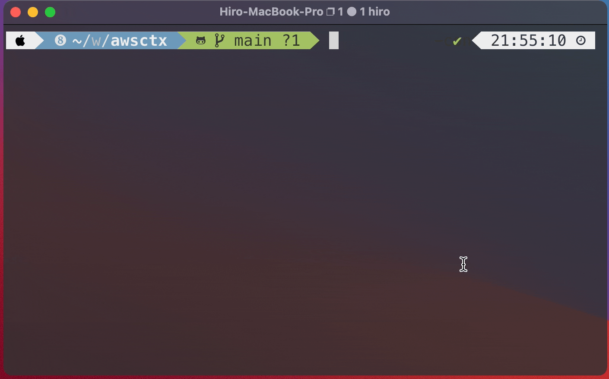

# awsctx


Context manager for AWS profiles with a fuzzy finder

## Demo
<div align="center">
  
</div>

## Usage
`help` command shows usage of each command.

```console
$ awsctx --help
USAGE:
    awsctx [OPTIONS] [SUBCOMMAND]

OPTIONS:
    -h, --help
            Print help information

    -v, --verbose
            Enable verbose output

    -V, --version
            Print version information

SUBCOMMANDS:
    active-context
            Show active context in the credentials
    auth
            Auth awscli with the specified profile by pre-defined scripts, then make it active
    completion
            Generate completion script
    help
            Print this message or the help of the given subcommand(s)
    list-contexts
            List all the contexts in the credentials
    refresh
            Auth awscli for the active profile by pre-defined scripts
    use-context
            Updates a default profile by a profile name
```

## Installation
### Homebrew (macOS only)
```console
$ brew tap hiro-o918/homebrew-tap
$ brew install awsctx
```

### CLI
**NOTE: [jq](https://github.com/stedolan/jq) required**

:arrow_down: Download a binary and move to `/usr/local/bin`

#### macOS
```console
$ curl -s https://api.github.com/repos/hiro-o918/awsctx/releases/latest \
  | jq -r '.assets[] | select(.name | test("^awsctx_v[0-9]+\\.[0-9]+\\.[0-9]+_x86_64-apple-darwin\\.tar\\.gz$")) | .browser_download_url' \
  | xargs wget -O - \
  | tar zxvf - \
  && mv awsctx /usr/local/bin
```

#### Linux
```console
$ curl -s https://api.github.com/repos/hiro-o918/awsctx/releases/latest \
  | jq -r '.assets[] | select(.name | test("^awsctx_v[0-9]+\\.[0-9]+\\.[0-9]+_x86_64-unknown-linux-musl\\.tar\\.gz$")) | .browser_download_url' \
  | xargs wget -O - \
  | tar zxvf - \
  && mv awsctx /usr/local/bin
```

## Configurations
### configs.yaml
`awsctx` refers to configurations in `~/.awsctx/configs.yaml`.
If you run `awsctx` once, configuration file is generated, or you can manually create new one to `~/.awsctx/configs.yaml`

The following is usage and an example of `configs.yaml`
```yaml
# Configurations for awsctx 
# You can manually edit configurations according to the following usage

# To use subcommand `auth` or `refresh`, fill the below configs for each profile.
auth_commands: 
  # configuration for `foo` profile with aws configure
  foo: |
    # you can use pre-defined parameter `{{profile}}` which is replaced by key of this block
    # In this case, `{{profile}}` is replaced by `foo`
    aws configure --profile {{profile}}
  # configuration for `bar` profile with [onelogin-aws-cli](https://github.com/physera/onelogin-aws-cli)
  bar: |
    # In this case, name of one-login configuration is same as `profile`
    onelogin-aws-login -C {{profile}} --profile {{profile}} -u user@example.com
```

### Configure Completion
To enable completion, run the below command.
If you install `awsctx` by homebrew, this operation is not required

```console
$ awsctx completion --shell zsh > /path/to/completions/_awsctx
```
Please replace `/path/to` with a path in your environment.
`bash`, `elvish` and `fish` are also available as a `--shell` option


## How it Works
### Login
Authorize your shell by some ways with specified profile name.
Then, you get `~/.aws/credentials` like
```
[foo]
aws_access_key_id = XXXXXXXXXXX
aws_secret_access_key = XXXXXXXXXXX
aws_session_token = XXXXXXXXXXXXXXXXXXXXXXXXXXXXXXXXXXXXXXXXXXXX

[bar]
aws_access_key_id = YYYYYYYYYYY
aws_secret_access_key = YYYYYYYYYYY
aws_session_token = YYYYYYYYYYYYYYYYYYYYYYYYYYYYYYYYYYYYYYYYYYYY
```

### Update the default profile by CLI
`use-context` update `~/.aws/credentials` to contain `default` profile that the values are same as specified in the option.

```console
$ awsctx use-context -p foo
```
e.g. the above commands updates credentials as the below.
```
[foo]
aws_access_key_id = XXXXXXXXXXX
aws_secret_access_key = XXXXXXXXXXX
aws_session_token = XXXXXXXXXXXXXXXXXXXXXXXXXXXXXXXXXXXXXXXXXXXX

[bar]
aws_access_key_id = YYYYYYYYYYY
aws_secret_access_key = YYYYYYYYYYY
aws_session_token = YYYYYYYYYYYYYYYYYYYYYYYYYYYYYYYYYYYYYYYYYYYY

[default]
aws_access_key_id = XXXXXXXXXXX
aws_secret_access_key = XXXXXXXXXXX
aws_session_token = XXXXXXXXXXXXXXXXXXXXXXXXXXXXXXXXXXXXXXXXXXXX
```
